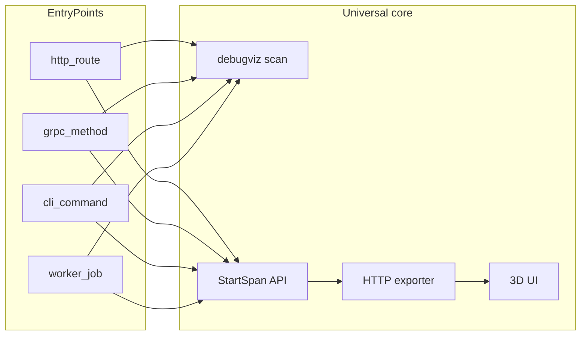
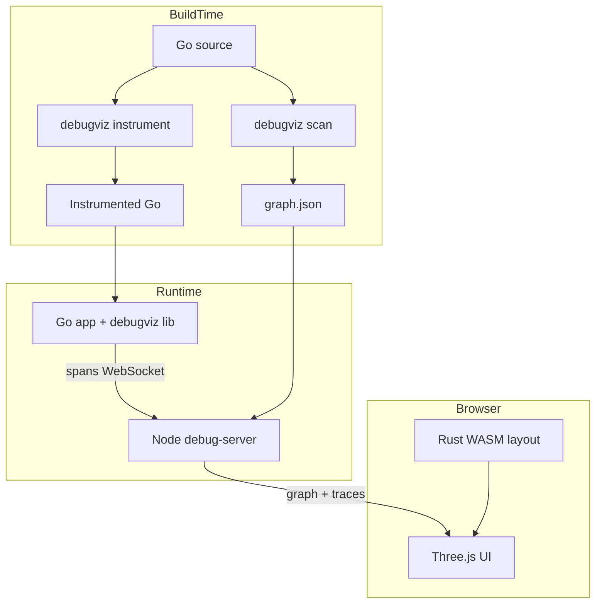

# DebugViz

> **Статус:** спецификация MVP v2 (Universal Go) зафиксирована; реализация ведётся по [бэклогу](docs/BACKLOG.md).

3D-визуализация кодовой базы Go-проекта с live-подсветкой **execution path** — пути выполнения от точки входа через файлы и функции.

**Для кого:** любой Go-проект с `context`-based code paths — HTTP (любой router), gRPC, CLI, background workers.

**Demo:** multi-runtime suite в `[demo/](demo/)` (HTTP primary для Quick Start). Пример HTTP-интеграции: [cv-backend](https://github.com/Maxim-Ba/cv-backend).

---

## Возможности

- **Статический граф** — packages, files, functions, entry points (HTTP/gRPC/CLI/worker), call edges
- **Live trace** — spans из runtime → WebSocket → анимированный path в 3D
- **Codegen** — автоматическая вставка `StartSpan` через `go generate`
- **Debug stack** — Node.js server + Three.js UI + Rust WASM layout

---


## Модель EntryPoint

Центральная сущность — **EntryPoint** (точка входа execution path), не привязанная к конкретному фреймворку:




| `kind`   | Пример `entry_name`           | Metadata            |
| -------- | ----------------------------- | ------------------- |
| `http`   | `GET /api/users/1`            | `{method, path}`    |
| `grpc`   | `user.v1.UserService/GetUser` | `{service, method}` |
| `cli`    | `migrate up`                  | `{command}`         |
| `worker` | `ProcessOrder`                | `{queue, job}`      |


---


## Архитектура




Build time: CLI сканирует код и генерирует `graph.json`, codegen инструментирует исходники.  
Runtime: Go-приложение отправляет spans на debug-server через entry hook (HTTP/gRPC/CLI/worker).  
Browser: UI загружает граф и подсвечивает path активного trace.

### Расшифровка терминов (диаграмма)


| Термин                    | Когда                 | Что это                                                                                                                                                                                                                                                    |
| ------------------------- | --------------------- | ---------------------------------------------------------------------------------------------------------------------------------------------------------------------------------------------------------------------------------------------------------- |
| **BuildTime**             | До запуска приложения | Фаза подготовки: анализ и изменение исходников. Выполняется на машине разработчика или в CI — **не** в работающем сервере. Сюда входят `debugviz scan`, `debugviz instrument`, `go generate`, `go build`.                                                  |
| **Go source**             | BuildTime             | Исходный код вашего Go-проекта: `.go` файлы, модули, packages. Это вход для scanner и codegen — они читают и (опционально) переписывают эти файлы.                                                                                                         |
| **debugviz scan**         | BuildTime             | CLI-команда статического анализа. Обходит `./...`, строит граф packages/files/functions/entry points/calls **без запуска** приложения. Результат — `graph.json` для загрузки в debug-server и отображения в UI.                                            |
| **debugviz instrument**   | BuildTime             | CLI-команда codegen. Вставляет вызовы `debugviz.StartSpan(...)` в тела функций (по правилам `debugviz.yaml`). Запускается вручную или через `//go:generate`. Не меняет runtime-логику — только добавляет tracing hooks в исходники.                        |
| **Instrumented Go**       | BuildTime → Runtime   | Исходники (и собранный binary) **после** `debugviz instrument`: в service/repo/handler уже есть `StartSpan` + `defer end()`. Если codegen не использовали — spans добавляются вручную или только на entry point (middleware/interceptor).                  |
| **Go app + debugviz lib** | Runtime               | Ваше приложение в процессе выполнения, подключившее runtime-библиотеку `go/lib/debugviz`. Она создаёт spans (`StartSpan`, HTTP/gRPC/CLI/worker hooks), батчит их и отправляет на debug-server. Без `-tags debugviz` / `DEBUGVIZ_ENABLED` библиотека no-op. |


**Кратко по потоку:**

1. **BuildTime:** `Go source` → `scan` → `graph.json`; `Go source` → `instrument` → `Instrumented Go` → `go build`.
2. **Runtime:** `Go app + debugviz lib` шлёт spans; debug-server хранит traces и стримит в UI.
3. **Browser:** UI совмещает статический граф (`graph.json`) с live spans и подсвечивает path.

---


## Quick Start

Увидеть результат без интеграции в свой проект (HTTP demo):

```bash
git clone https://github.com/Maxim-Ba/debugviz.git
cd debugviz
docker compose up
```

**WSL + Docker Desktop:** если сборка падает с `error getting credentials` / `docker-credential-desktop.exe: exec format error`, в WSL удалите Windows credential helper из `~/.docker/config.json` (оставьте `{}` или уберите ключ `credsStore`), затем повторите `docker compose up`. Альтернатива — запускать compose из PowerShell/CMD, где Docker Desktop настроен нативно.


| Сервис       | URL                                            |
| ------------ | ---------------------------------------------- |
| UI           | [http://localhost:3000](http://localhost:3000) |
| Landing      | [http://localhost:3000/landing/](http://localhost:3000/landing/) |
| debug-server | [http://localhost:4000](http://localhost:4000) |
| demo HTTP    | [http://localhost:8080](http://localhost:8080) |
| demo gRPC    | `localhost:9090` (reflection enabled)          |


```bash
# HTTP (M0–M2)
curl http://localhost:8080/api/users/1

# gRPC (M5, demo/grpc)
grpcurl -plaintext localhost:9090 user.v1.UserService/GetUser

# CLI (M5, demo/cli)
./demo-cli migrate up

# Worker (M5, demo/worker)
# worker запускается в docker compose, trace виден после обработки job
```

**Ожидаемый результат:** в UI на [http://localhost:3000](http://localhost:3000) подсвечен execution path от entry point до глубины call stack (< 1 сек).

---


## Usage

Три уровня внедрения — каждый самодостаточен. Можно остановиться на любом уровне.


| Уровень                                        | Milestone | Что получаете                    |
| ---------------------------------------------- | --------- | -------------------------------- |
| [Сценарий 1](#сценарий-1--статический-граф-m1) | M1        | 3D-граф кодовой базы без runtime |
| [Сценарий 2](#сценарий-2--live-trace-m2--m5) | M2 + M5   | Live path от entry point         |
| [Сценарий 3](#сценарий-3--codegen-m3--m6)    | M3 + M6   | Auto-instrumentation + auto wire |


### Выбор integration


| Тип приложения                | Root span hook                    | Scanner `--framework`                      |
| ----------------------------- | --------------------------------- | ------------------------------------------ |
| HTTP (chi, gin, echo, stdlib) | `debugviz.HTTPMiddleware`         | `auto` / `chi` / `gin` / `echo` / `stdlib` |
| gRPC                          | `debugviz.UnaryServerInterceptor` | `grpc` или `auto`                          |
| CLI (cobra, urfave/cli)       | `debugviz.RunCLI`                 | `cli` или `auto`                           |
| Worker / cron / queue         | `debugviz.RunJob`                 | `auto` (best-effort)                       |

### Два пути интеграции

Runtime API (`Configure`, `HTTPMiddleware`, …) — **контракт библиотеки**. Вызывать его вручную не обязательно: codegen может вставить те же вызовы за вас.

| | **Рекомендуемый (M6+)** | **Ручной (M2, Advanced)** |
|---|-------------------------|---------------------------|
| **Когда** | После `debugviz wire` | С M2, до wire; escape hatch |
| **Entry + bootstrap** | `debugviz wire` → правит `main` | `Configure` + hooks в `main` |
| **Inner spans** | `debugviz instrument` | `instrument` или ручные `StartSpan` |
| **Файлы разработчика** | `debugviz.yaml` + `//go:generate` | + явные вызовы API в коде |
| **Риск** | codegen merge в `main` (golden tests) | больше boilerplate |

**Рекомендуемый поток (целевой UX):**

```yaml
# debugviz.yaml
server_url: http://localhost:4000
service_name: my-app

wire:
  main: ./cmd/app/main.go
  # опционально: явные targets вместо auto-detect
  http:
    listen_and_serve: true
  grpc:
    new_server: true

include:
  - "internal/services/**"
  - "internal/repository/**"
```

```go
// cmd/app/main.go
package main

//debugviz:app name=my-app
//go:generate debugviz wire --config debugviz.yaml --write
//go:generate debugviz instrument --config debugviz.yaml --write ./...

func main() {
    mux := http.NewServeMux()
    mux.HandleFunc("/api/users/", userHandler)
    http.ListenAndServe(":8080", mux) // без debugviz в исходнике
}
```

```bash
go generate ./...
go build -tags debugviz ./cmd/app
```

После `wire` в `main` **появятся** (не пишутся руками): `Configure`/`ConfigureFromEnv`, обёртка `HTTPMiddleware`, gRPC interceptors или `RunCLI` — по типу приложения.

**Ручной путь** — [Сценарий 2](#сценарий-2--live-trace-m2--m5): для нестандартной сборки router, кастомного порядка middleware или отладки wire.

---

### Установка


| Компонент                        | Команда                                                          |
| -------------------------------- | ---------------------------------------------------------------- |
| CLI                              | `go install github.com/Maxim-Ba/debugviz/go/cmd/debugviz@latest` |
| Runtime library                  | `go get github.com/Maxim-Ba/debugviz/go/lib/debugviz`            |
| Debug stack (server + UI + demo) | `docker compose up` или `make dev`                               |


```bash
debugviz version
debugviz scan --help
debugviz instrument --help
```

---


### Сценарий 1 — Статический граф (M1)

**Цель:** увидеть 3D-граф кодовой базы без runtime instrumentation.

#### Шаг 1 — сканирование

```bash
cd /path/to/your-go-project
debugviz scan ./... \
  --output graph.json \
  --framework auto
```

**Флаги** `debugviz scan`**:**


| Флаг              | Default | Описание                                                    |
| ----------------- | ------- | ----------------------------------------------------------- |
| `--output`, `-o`  | stdout  | Путь к выходному файлу                                      |
| `--format`        | `json`  | Формат: `json` | `dot`                                      |
| `--framework`     | `auto`  | `auto` | `chi` | `gin` | `echo` | `stdlib` | `grpc` | `cli` |
| `--include-tests` | `false` | Включить `*_test.go`                                        |


`auto` определяет adapters по imports (`go-chi/chi`, `gin-gonic/gin`, `labstack/echo`, `google.golang.org/grpc`, `spf13/cobra`, …).

**Fallback** — ручные entry points в `debugviz.yaml`:

```yaml
entries:
  - kind: http
    method: GET
    path: /api/custom
    handler: internal/handlers.Custom
  - kind: grpc
    service: user.v1.UserService
    method: GetUser
  - kind: cli
    command: migrate up
    handler: cmd/migrate.runMigrate
```

**Ожидаемый результат:** `graph.json` с узлами (`package`, `file`, `function`, `entry_point`, `middleware`) и рёбрами (`imports`, `calls`, `entry_handles`, `middleware_chain`).

Узел `entry_point` содержит `kind` и `metadata` (см. [Модель EntryPoint](#модель-entrypoint)).

#### Шаг 2 — загрузка графа

```bash
curl -X POST http://localhost:4000/api/graph \
  -H "Content-Type: application/json" \
  --data-binary @graph.json

curl http://localhost:4000/api/graph/meta
# {"nodes": 142, "edges": 387, "entry_points": 28, ...}
```


#### Шаг 3 — просмотр в UI

Откройте [http://localhost:3000](http://localhost:3000).

**Ожидаемый результат:**

- packages — сферы, files — boxes
- entry points — цвет/иконка по `kind` (HTTP method, gRPC service, CLI command, worker job)
- imports — тонкие линии, calls — стрелки
- zoom: package level → file level (LOD)

---


### Сценарий 2 — Live trace (M2 + M5)

**Цель:** подсветка execution path в реальном времени.

Предварительно: debug-server и UI запущены, граф загружен (Сценарий 1).

> **Recommended:** используйте [`debugviz wire`](#два-пути-интеграции) (M6) — без ручного `Configure` / middleware в исходниках.  
> Ниже — **ручной путь (Advanced)** для M2 и edge cases.

#### Общая инициализация (`main.go`)

```go
package main

import (
    "log"

    "github.com/Maxim-Ba/debugviz/go/lib/debugviz"
)

func main() {
    if err := debugviz.Configure(debugviz.Config{
        ServerURL:   "http://localhost:4000",
        ServiceName: "my-app",
        Enabled:     true,
        BatchSize:   50,
        SampleRate:  1.0,
    }); err != nil {
        log.Fatalf("debugviz: %v", err)
    }

    // ... entry hook для вашего типа приложения (см. ниже)
}
```

`Configure` — один раз при старте. `Enabled: false` → zero overhead, spans не экспортируются.

#### HTTP — universal `net/http` middleware

Работает с **любым** router (chi, gin, echo, stdlib):

```go
import (
    "net/http"

    "github.com/Maxim-Ba/debugviz/go/lib/debugviz"
)

func main() {
    // ... Configure ...

    mux := http.NewServeMux()
    mux.HandleFunc("/api/users/", userHandler)

    handler := debugviz.HTTPMiddleware(mux, debugviz.HTTPMiddlewareConfig{
        ServiceName: "my-app",
    })
    http.ListenAndServe(":8080", handler)
}
```

Опциональные thin wrappers для chi/gin/echo — re-export поверх `HTTPMiddleware`:

```go
// chi
r.Use(debugviz.ChiMiddleware(debugviz.HTTPMiddlewareConfig{ServiceName: "my-app"}))
```

Root span: method, path, status, duration. Propagate `X-Trace-ID` из заголовка или генерирует новый.

**Проверка:**

```bash
curl -H "X-Trace-ID: demo-trace-1" http://localhost:8080/api/users/1
```


#### gRPC — interceptors

```go
import (
    "google.golang.org/grpc"

    "github.com/Maxim-Ba/debugviz/go/lib/debugviz"
)

func main() {
    // ... Configure ...

    srv := grpc.NewServer(
        grpc.ChainUnaryInterceptor(debugviz.UnaryServerInterceptor()),
        grpc.ChainStreamInterceptor(debugviz.StreamServerInterceptor()),
    )
    pb.RegisterUserServiceServer(srv, &userServer{})
    // ...
}
```

**Проверка:**

```bash
grpcurl -plaintext -H "x-trace-id: demo-trace-1" \
  -d '{"id": 1}' localhost:9090 user.v1.UserService/GetUser
```

**Ожидаемый результат:** root span с `entry_kind: grpc`, `entry_name: user.v1.UserService/GetUser`.

#### CLI — root span

```go
import (
    "context"

    "github.com/spf13/cobra"
    "github.com/Maxim-Ba/debugviz/go/lib/debugviz"
)

func main() {
    // ... Configure ...

    err := debugviz.RunCLI("myapp", func(ctx context.Context) error {
        return rootCmd.ExecuteContext(ctx)
    })
    if err != nil {
        log.Fatal(err)
    }
}
```

**Проверка:**

```bash
./myapp migrate up
```

**Ожидаемый результат:** root span с `entry_kind: cli`, `entry_name: migrate up`.

#### Worker — job span

```go
func processMessage(ctx context.Context, msg Message) error {
    return debugviz.RunJob(ctx, "ProcessOrder", func(ctx context.Context) error {
        return handleOrder(ctx, msg.OrderID)
    })
}
```

**Ожидаемый результат:** root span с `entry_kind: worker`, `entry_name: ProcessOrder`.

#### Manual spans (все типы приложений)

```go
func (s *TechService) GetByID(ctx context.Context, id int) (*Tech, error) {
    ctx, end := debugviz.StartSpan(ctx, "TechService.GetByID")
    defer end()
    return s.repo.FindByID(ctx, id)
}
```


#### Runtime API

Вызываются **вручную** (Advanced) или **codegen'ом** `debugviz wire` (Recommended):

| Функция                               | Описание                  |
| ------------------------------------- | ------------------------- |
| `Configure(cfg Config) error`         | Инициализация exporter    |
| `StartSpan(ctx, name) (ctx, end)`     | Дочерний span             |
| `SpanFromContext(ctx) *Span`          | Текущий span              |
| `HTTPMiddleware(h, cfg) http.Handler` | Root span для HTTP        |
| `UnaryServerInterceptor()`            | Root span для gRPC unary  |
| `StreamServerInterceptor()`           | Root span для gRPC stream |
| `RunCLI(name, fn) error`              | Root span для CLI         |
| `RunJob(ctx, name, fn) error`         | Root span для worker job  |


#### Сборка и запуск

```bash
go run -tags debugviz ./cmd/app
# или
DEBUGVIZ_ENABLED=true go run ./cmd/app
```


#### Ожидаемый результат в UI

- WS indicator — connected
- Animated pulse по path от entry point через call stack
- Timeline panel — waterfall spans
- Error spans — красная подсветка
- Unmapped spans — в sidebar

---


### Сценарий 3 — Codegen (M3 + M6)

**Цель:** auto-instrumentation без ручных `StartSpan` и (с M6) без ручного wiring entry points.

Полный recommended pipeline:

```bash
go generate ./...   # wire (entry) + instrument (inner)
go build -tags debugviz ./...
```

#### Конфиг `debugviz.yaml`

```yaml
server_url: http://localhost:4000
service_name: my-app

wire:
  main: ./cmd/app/main.go

include:
  - "internal/services/**"
  - "internal/repository/**"
exclude:
  - "**/*_test.go"
  - "**/mocks/**"
require_context: true
entry_packages:
  - "internal/handlers/**"
  - "internal/grpc/**"
  - "cmd/**"
allow_no_context: false  # true — worker handlers без ctx (opt-in, Issue 5.5)
```


| Поле                     | Описание                                                          |
| ------------------------ | ----------------------------------------------------------------- |
| `require_context: true`  | Default: только `func(ctx context.Context, ...)`                  |
| `allow_no_context: true` | Worker handlers: оборачивает body в `context.Background()` + span |
| `entry_packages`         | Приоритет instrument packages рядом с entry points                |


#### Команды

```bash
debugviz instrument --config debugviz.yaml --dry-run ./...
debugviz instrument --config debugviz.yaml --write ./...
```

```go
//go:generate debugviz wire --config debugviz.yaml --write
//go:generate debugviz instrument --config debugviz.yaml --write ./...
```

```bash
go generate ./...
go build -tags debugviz ./...
```


#### До / после codegen

**До:**

```go
func (s *TechService) GetByID(ctx context.Context, id int) (*Tech, error) {
    return s.repo.FindByID(ctx, id)
}
```

**После:**

```go
func (s *TechService) GetByID(ctx context.Context, id int) (*Tech, error) {
    ctx, __dv_end := debugviz.StartSpan(ctx, "services.TechService.GetByID")
    defer __dv_end()
    return s.repo.FindByID(ctx, id)
}
```

Codegen идемпотентен.

---


### Пример: HTTP-интеграция (cv-backend)

[cv-backend](https://github.com/Maxim-Ba/cv-backend) — **пример HTTP-приложения**, не единственный supported target. Подробности: [examples/cv-backend/INTEGRATION.md](examples/cv-backend/INTEGRATION.md).

1. `go get github.com/Maxim-Ba/debugviz/go/lib/debugviz`
2. `debugviz scan ./... -o graph.json --framework auto` → POST `/api/graph`
3. `HTTPMiddleware` или `ChiMiddleware` в `internal/router/router.go`
4. `go generate` + `-tags debugviz`
5. `docker compose up` (debugviz stack + cv-backend)
6. `curl http://localhost:8080/api/tech/1` → path visible в UI

---


### Конфигурация


#### Environment variables


| Переменная              | Default                 | Описание               |
| ----------------------- | ----------------------- | ---------------------- |
| `DEBUGVIZ_ENABLED`      | `false`                 | Включить экспорт spans |
| `DEBUGVIZ_SERVER_URL`   | `http://localhost:4000` | URL debug-server       |
| `DEBUGVIZ_SERVICE_NAME` | —                       | Имя сервиса в traces   |
| `DEBUGVIZ_SAMPLE_RATE`  | `1.0`                   | Доля traces (0.0–1.0)  |
| `DEBUGVIZ_BATCH_SIZE`   | `50`                    | Spans в batch POST     |


#### Struct `Config`

```go
type Config struct {
    ServerURL   string
    ServiceName string
    Enabled     bool
    BatchSize   int
    SampleRate  float64
}
```


#### Exporter behavior

- Async batch POST на `POST /api/traces/spans`
- Retry с exponential backoff
- Ring buffer до 1000 spans при offline server

---


### Debug-server API и UI


#### HTTP API


| Method | Path                | Описание                          |
| ------ | ------------------- | --------------------------------- |
| `POST` | `/api/graph`        | Upload `graph.json`               |
| `GET`  | `/api/graph`        | Текущий граф                      |
| `GET`  | `/api/graph/meta`   | Stats: nodes, edges, entry_points |
| `POST` | `/api/traces/spans` | Batch ingest spans                |
| `GET`  | `/api/traces`       | Recent traces (last 50)           |
| `GET`  | `/api/traces/:id`   | Full trace by trace_id            |
| `WS`   | `/ws`               | Subscribe to trace updates        |


#### Span format

```json
{
  "trace_id": "uuid",
  "span_id": "uuid",
  "parent_span_id": "uuid|null",
  "name": "TechService.GetByID",
  "file": "internal/services/technology.go",
  "line": 42,
  "start_us": 1710000000,
  "duration_us": 1200,
  "status": "ok",
  "entry_kind": "http",
  "entry_name": "GET /api/tech/1"
}
```

`entry_kind` / `entry_name` заполняются только у root span.

#### UI ([http://localhost:3000](http://localhost:3000))


| Функция                  | Milestone | Описание                         |
| ------------------------ | --------- | -------------------------------- |
| 3D graph view            | M1        | OrbitControls, package/file LOD  |
| Entry point icons/colors | M5        | По `kind`, не только HTTP method |
| Entry point picker       | M5        | Filter by kind (http/grpc/cli/worker) |
| Live path highlight      | M2        | Любой root span, не только HTTP  |
| Timeline / waterfall     | M2        | Spans, duration, errors          |
| Trace history, filters   | P2        | Issue 3.5                        |
| Heatmap mode             | P2        | Aggregate latency по edges       |


---


## Ограничения MVP

**Поддерживается:**

- HTTP: chi, gin, echo, stdlib `net/http` (явная регистрация routes)
- gRPC: unary + stream (P1, M5)
- CLI: cobra, urfave/cli (P2, M5, best-effort discovery)
- Workers: explicit `RunJob` + best-effort discovery (P2, M5)
- Go 1.22+, single-service traces
- Codegen: `context.Context` первым аргументом (opt-in `allow_no_context` для workers)

**Best-effort (не гарантируется 100% discovery):**

- CLI subcommands без cobra/urfave patterns
- Worker/cron hooks без явных naming conventions
- Interface calls в call graph → `confidence: interface`

**Post-MVP (out of scope):**

- eBPF / zero-code auto-instrumentation
- Multi-service distributed traces
- Auth для debug-server
- PostgreSQL persistence
- Reflection-based route discovery
- fiber router adapter

---


## DebugViz vs Jaeger


|                | Jaeger                            | DebugViz                            |
| -------------- | --------------------------------- | ----------------------------------- |
| Фокус          | Distributed tracing (2D timeline) | Code graph + execution path (3D)    |
| Что видно      | Service → service spans           | File → function внутри binary       |
| Entry types    | HTTP/gRPC (generic)               | HTTP/gRPC/CLI/worker mapped to code |
| Code structure | Нет                               | Static graph + entry points         |
| Setup          | Agent + collector + UI            | CLI scan + entry hook + local stack |
| Overhead       | Agent sidecar                     | In-process, `-tags debugviz` opt-in |


---


## Benchmark

Локальный прогон: `make benchmark` (Go `testing.B`, Windows/Linux, 5 прогонов).

Измерение — синтетический HTTP handler + in-process exporter (без сетевого RTT). **Overhead** — прирост latency относительно handler ~100 µs (типичный лёгкий REST handler).

| Mode            | ns/op | RPS (1 core) | Overhead vs 100 µs handler |
| --------------- | ----- | ------------ | -------------------------- |
| No trace        | ~35   | ~29M         | —                          |
| HTTP middleware | ~1.7k | ~590k        | ~1.7%                      |
| Manual spans    | ~2.4k | ~410k        | ~2.4%                      |
| Codegen spans   | ~4.0k | ~250k        | ~4.0%                      |

Target: overhead < 5% на типичном handler — **Codegen spans укладываются**.

Исходники: [`go/lib/debugviz/bench_test.go`](go/lib/debugviz/bench_test.go), отчёт: [`scripts/benchmark.sh`](scripts/benchmark.sh).

---


## Разработка monorepo


### Структура

```
debugviz/
├── go/
│   ├── cmd/debugviz/
│   ├── lib/debugviz/
│   └── pkg/
│       ├── scanner/
│       │   └── adapters/    # EntryDiscoverer: chi, gin, grpc, cli, ...
│       ├── codegen/
│       │   ├── instrument/  # inner spans (M3)
│       │   └── wire/        # entry hooks + Configure (M6)
│       └── protocol/
├── server/
├── web/
├── landing/                # portfolio / demo page (Issue 7.4)
├── rust/layout/
├── demo/
│   ├── http/               # chi REST (Quick Start)
│   ├── grpc/
│   ├── cli/
│   └── worker/
├── examples/cv-backend/
├── schemas/
└── docs/
```


### Команды

```bash
make dev      # server + web + demo/http (hot reload)
make test     # go test + pnpm test + wasm-pack test
make scan     # debugviz scan ./demo/http -o /tmp/graph.json
make lint     # golangci-lint + eslint
make benchmark   # HTTP tracing overhead (Issue 7.3)
make docker-smoke  # docker compose up + Epic 7 E2E
```


### Документация

- [docs/BACKLOG.md](docs/BACKLOG.md) — трекинг задач
- [docs/MVP_PLAN.md](docs/MVP_PLAN.md) — детальный план
- [examples/cv-backend/INTEGRATION.md](examples/cv-backend/INTEGRATION.md) — HTTP example

**Оценка:** 11–13 недель part-time (M0–M6 + M4 polish).

---


## License

MIT — см. [LICENSE](LICENSE).