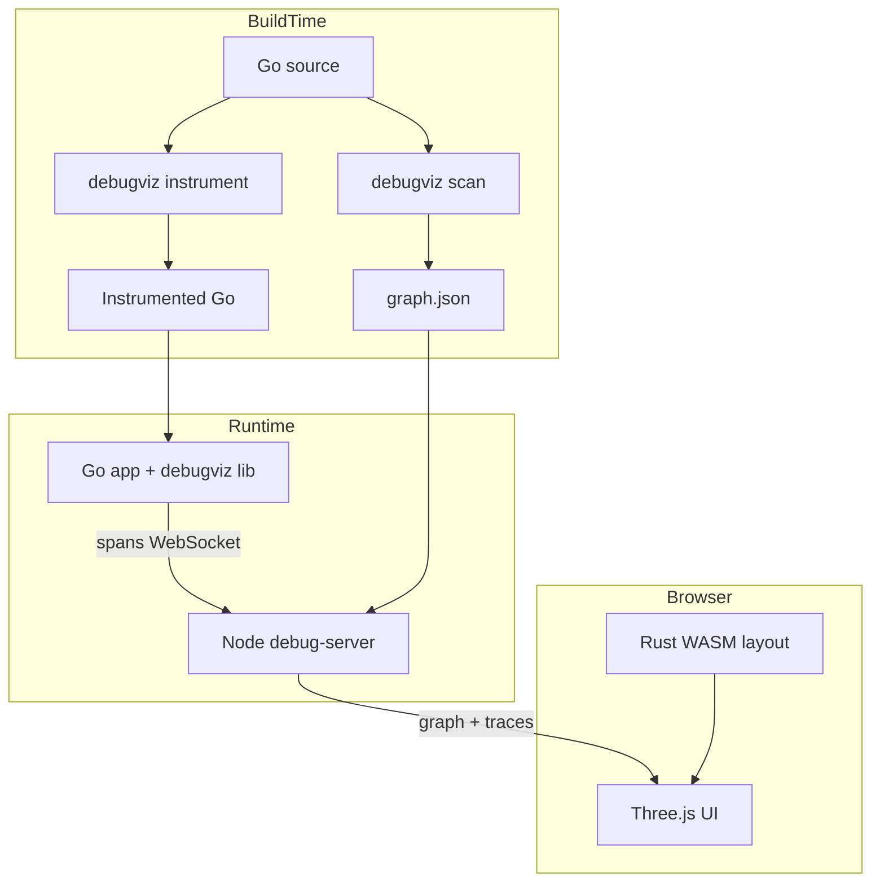
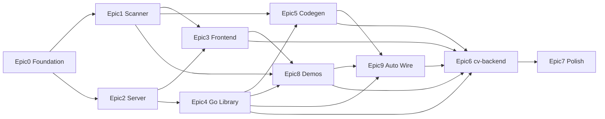

# DebugViz — MVP Plan (Universal Go)

## Контекст и цель

**DebugViz** — инструмент для 3D-визуализации кодовой базы Go-проекта с live-подсветкой **execution path** от точки входа (EntryPoint) через файлы и функции.

**Целевая аудитория:** любой Go-проект — HTTP (chi/gin/echo/stdlib), gRPC, CLI, background workers.

**Demo-приложения:**
- Multi-runtime suite в `demo/` (http, grpc, cli, worker)
- HTTP example: [cv-backend](U:/projects/Go_Training/cv-backend) — chi v5, слои `router → services → repository`

**Scope:** Phase 1–3 (статика, live trace, inner codegen) + M5 (universal entry points) + M6 (auto wire) + demo + docs.

**Репозиторий:** standalone monorepo `debugviz/`. Module: `github.com/Maxim-Ba/debugviz`.

**Оценка:** 11–13 недель part-time.

---

## Модель EntryPoint

| Было (v1) | Стало (v2) |
|-----------|------------|
| node type `route` | `entry_point` с `kind`: `http` \| `grpc` \| `cli` \| `worker` |
| edge `handles` | `entry_handles` (entry → function) |
| chi-specific metadata | `metadata` per kind |

Trace event: поля `entry_kind`, `entry_name` на root span.

---

## Архитектура



---

## Структура monorepo

```
debugviz/
├── go/
│   ├── cmd/debugviz/
│   ├── lib/debugviz/
│   └── pkg/
│       ├── scanner/
│       │   └── adapters/      # EntryDiscoverer
│       ├── codegen/
│       │   ├── instrument/
│       │   └── wire/
│       └── protocol/
├── server/
├── web/
├── rust/layout/
├── demo/
│   ├── http/
│   ├── grpc/
│   ├── cli/
│   └── worker/
├── examples/cv-backend/
├── schemas/
├── docs/
├── docker-compose.yml
└── README.md
```

---

## Milestones и timeline

| Milestone | Недели | Результат |
|-----------|--------|-----------|
| M0 Foundation | 1 | Repo, schemas (entry_point), CI, demo/http skeleton |
| M1 Static Graph | 2 | `debugviz scan` → 3D graph, HTTP adapters |
| M2 Live Trace | 2 | HTTPMiddleware + WS + path highlight |
| M3 Codegen | 2 | `go generate` + `-tags debugviz` |
| M5 Universal Entry Points | 2 | gRPC, CLI, worker hooks + demos + UI picker |
| M6 Auto Wire | 1.5 | `debugviz wire` — codegen entry hooks + Configure |
| M4 Polish | 1 | cv-backend guide, Docker, README, video |

**Оценка:** 11–13 недель part-time.

---

## Epic 0: Foundation (M0)

### Issue 0.1 — Инициализация monorepo и tooling
**Приоритет:** P0 | **Оценка:** 2d

- Repo `debugviz`, pnpm workspaces, Go module `github.com/Maxim-Ba/debugviz`
- ESLint/Prettier, golangci-lint, rustfmt
- GitHub Actions: `go test`, `pnpm test`, `wasm-pack build`
- `docker-compose.yml`: server + web + demo/http

**Критерии приёмки:**
- `make dev` поднимает все сервисы
- CI green на пустых пакетах

---

### Issue 0.2 — JSON-схемы для graph и trace
**Приоритет:** P0 | **Оценка:** 1d

Файлы: `schemas/graph.schema.json`, `schemas/trace-event.schema.json`

**Типы узлов:** `package`, `file`, `function`, `entry_point`, `middleware`

**entry_point:**
```json
{
  "id": "entry:http:GET:/api/users/{id}",
  "type": "entry_point",
  "kind": "http",
  "name": "GET /api/users/{id}",
  "metadata": { "method": "GET", "path": "/api/users/{id}" }
}
```

**Типы рёбер:** `imports`, `calls`, `entry_handles`, `middleware_chain`

**Trace event (расширенный):**
```json
{
  "trace_id": "uuid",
  "span_id": "uuid",
  "parent_span_id": "uuid|null",
  "name": "TechService.GetByID",
  "file": "internal/services/technology.go",
  "line": 42,
  "start_us": 1710000000,
  "duration_us": 1200,
  "status": "ok|error",
  "entry_kind": "http|grpc|cli|worker",
  "entry_name": "GET /api/tech/1"
}
```

**Критерии приёмки:**
- Go structs + TS types синхронизированы
- Пример `schemas/examples/demo-http-graph.json`

---

### Issue 0.3 — Multi-runtime demo suite (HTTP primary)
**Приоритет:** P0 | **Оценка:** 2d

`demo/http/` — chi REST (Quick Start):
- 2 entity (users, items), handler → service → repo, 5–6 endpoints

**Критерии приёмки:**
- `go run ./demo/http` на `:8080`
- Структура слоёв как cv-backend для документации

---

## Epic 1: Static Scanner (M1 + M5)

### Issue 1.1 — Сканер графа пакетов/файлов
**Приоритет:** P0 | **Оценка:** 3d

Пакет: `go/pkg/scanner/`

- Обход `./...` через `go/packages`
- Узлы: packages, files
- Рёбра: import dependencies

**Критерии приёмки:**
- `debugviz scan ./demo/http` → stdout JSON
- cv-backend (~107 файлов) < 3 сек

---

### Issue 1.2 — HTTP entry discovery (framework adapters)
**Приоритет:** P0 | **Оценка:** 4d

Пакет: `go/pkg/scanner/adapters/`

Интерфейс `EntryDiscoverer`:
```go
type EntryDiscoverer interface {
    Name() string
    Discover(pkgs []*packages.Package) ([]EntryPoint, error)
}
```

Adapters: **chi**, **gin**, **echo**, **stdlib** (`http.HandleFunc`, `ServeMux`)

- Узлы `entry_point` kind=`http`
- Рёбра `entry_handles`: entry → handler function

Fallback: `debugviz.yaml` → `entries:` (manual annotations)

**Критерии приёмки:**
- Demo http: все routes в графе
- cv-backend: ≥ 20 REST routes
- gin/echo demo: routes discovered

---

### Issue 1.3 — Call graph (intra/inter-package)
**Приоритет:** P1 | **Оценка:** 4d

- `go/ast` + `go/types`: вызовы между файлами
- Рёбра `calls` с confidence: `static` | `interface` | `unknown`

**Критерии приёмки:**
- cv-backend: path из ≥ 4 файлов для одного entry point
- Interface calls → `confidence: interface`

---

### Issue 1.4 — CLI `debugviz scan`
**Приоритет:** P0 | **Оценка:** 1d

```
debugviz scan [flags] ./...
  --output graph.json
  --format json|dot
  --include-tests
  --framework auto|chi|gin|echo|stdlib|grpc|cli
```

**Критерии приёмки:**
- `--framework auto` выбирает adapters по imports
- Golden file test на demo/http

---

### Issue 1.5 — gRPC entry discovery
**Приоритет:** P1 | **Оценка:** 3d

- Парсинг `Register*Server(srv, &handler{})` в main/grpc setup
- Связь с protobuf service/method names (best-effort через generated code refs)
- Узлы `entry_point` kind=`grpc`

**Критерии приёмки:**
- demo/grpc: все unary methods в графе
- metadata: `{service, method}`

---

### Issue 1.6 — CLI entry discovery
**Приоритет:** P2 | **Оценка:** 2d

- cobra: `rootCmd.AddCommand`, `Use` fields
- urfave/cli: `Commands`, `Action`
- Узлы `entry_point` kind=`cli`

**Критерии приёмки:**
- demo/cli: subcommands `migrate up`, `serve` в графе

---

### Issue 1.7 — Worker entry discovery
**Приоритет:** P2 | **Оценка:** 2d

Best-effort patterns:
- `Consume`, `Handle`, `Process` func names
- cron: `AddFunc`, robfig/cron patterns
- Узлы `entry_point` kind=`worker`

**Критерии приёмки:**
- demo/worker: ≥ 1 job entry в графе
- Unmatched jobs → manual `entries` в yaml

---

## Epic 2: Debug Server (M1–M2)

### Issue 2.1 — HTTP API + загрузка статического графа
**Приоритет:** P0 | **Оценка:** 2d

```
POST /api/graph
GET  /api/graph
GET  /api/graph/meta     — stats incl. entry_points count
```

**Критерии приёмки:**
- Валидация schema v2 (entry_point nodes)

---

### Issue 2.2 — Приём trace + WebSocket
**Приоритет:** P0 | **Оценка:** 3d

```
POST /api/traces/spans
WS   /ws
GET  /api/traces/:id
GET  /api/traces
```

**Критерии приёмки:**
- Spans с `entry_kind`/`entry_name` → WS broadcast < 100ms

---

### Issue 2.3 — Маппинг span → node
**Приоритет:** P0 | **Оценка:** 2d

- `{file, line}` → function → file → package
- Root span: match `entry_kind` + `entry_name` → entry_point node
- Fallback: fuzzy match по `name`

**Критерии приёмки:**
- 95% spans demo/http маппятся
- gRPC root span → entry_point node (M5)

---

## Epic 3: 3D Frontend (M1–M2 + M5)

### Issue 3.1 — Bootstrap Three.js сцены
**Приоритет:** P0 | **Оценка:** 3d

- Vite + React, OrbitControls, instanced nodes

**Критерии приёмки:**
- 500 nodes @ 60fps

---

### Issue 3.2 — Graph layout (JS → WASM)
**Приоритет:** P1 | **Оценка:** 4d

Phase A: JS force-directed. Phase B: Rust WASM.

---

### Issue 3.3 — Отрисовка рёбер + labels
**Приоритет:** P1 | **Оценка:** 2d

- Entry points: цвет/иконка по `kind` (не только HTTP method)
- HTTP: цвет по method; gRPC: по service; CLI/worker: distinct style

---

### Issue 3.4 — Live trace visualization
**Приоритет:** P0 | **Оценка:** 4d

- Live highlight для **любого** root span (HTTP, gRPC, CLI, worker)
- Timeline, error highlight

**Критерии приёмки:**
- curl / grpcurl / cli command → path visible < 1s

---

### Issue 3.5 — UI panels (trace history, filters)
**Приоритет:** P2 | **Оценка:** 2d

---

### Issue 3.6 — Entry point picker
**Приоритет:** P1 | **Оценка:** 2d

- Dropdown/filter entry points by `kind`
- Trigger demo trace from UI (optional)

**Критерии приёмки:**
- Filter: http | grpc | cli | worker
- List populated from graph entry_point nodes

---

## Epic 4: Go Runtime Library (M2 + M5)

### Issue 4.1 — Core span API
**Приоритет:** P0 | **Оценка:** 2d

```go
func StartSpan(ctx context.Context, name string) (context.Context, func())
func SpanFromContext(ctx context.Context) *Span
func Configure(cfg Config) error
```

**Критерии приёмки:**
- Zero export when disabled, overhead < 5%

---

### Issue 4.2 — Universal HTTP middleware
**Приоритет:** P0 | **Оценка:** 2d

```go
func HTTPMiddleware(next http.Handler, cfg HTTPMiddlewareConfig) http.Handler
```

- Root span: method, path, status, duration
- Propagate `X-Trace-ID`
- `entry_kind: http`, `entry_name: "{method} {path}"`

**Критерии приёмки:**
- Работает с stdlib ServeMux, chi, gin, echo
- Demo http: каждый request → trace

---

### Issue 4.3 — HTTP exporter
**Приоритет:** P0 | **Оценка:** 1d

- Batch POST, retry, ring buffer 1000 spans

---

### Issue 4.4 — Manual span helpers
**Приоритет:** P1 | **Оценка:** 1d

- Паттерн для service/repo во всех demo apps

---

### Issue 4.5 — Router thin wrappers
**Приоритет:** P2 | **Оценка:** 1d

```go
func ChiMiddleware(cfg HTTPMiddlewareConfig) func(http.Handler) http.Handler
func GinMiddleware(cfg HTTPMiddlewareConfig) gin.HandlerFunc
func EchoMiddleware(cfg HTTPMiddlewareConfig) echo.MiddlewareFunc
```

Re-export поверх `HTTPMiddleware`.

---

### Issue 4.6 — gRPC interceptors
**Приоритет:** P1 | **Оценка:** 2d

```go
func UnaryServerInterceptor() grpc.UnaryServerInterceptor
func StreamServerInterceptor() grpc.StreamServerInterceptor
```

- `entry_kind: grpc`, `entry_name: "{service}/{method}"`

**Критерии приёмки:**
- demo/grpc: grpcurl → trace в UI

---

### Issue 4.7 — CLI root span hook
**Приоритет:** P2 | **Оценка:** 1d

```go
func RunCLI(appName string, fn func(ctx context.Context) error) error
```

- `entry_kind: cli`, `entry_name` из cobra command path

**Критерии приёмки:**
- demo/cli: `./demo-cli migrate up` → trace

---

### Issue 4.8 — Worker job span hook
**Приоритет:** P2 | **Оценка:** 1d

```go
func RunJob(ctx context.Context, jobName string, fn func(ctx context.Context) error) error
```

- `entry_kind: worker`, `entry_name: jobName`

**Критерии приёмки:**
- demo/worker: job processed → trace в UI

---

## Epic 5: Codegen Instrumentation (M3)

### Issue 5.1 — AST-анализатор функций
**Приоритет:** P0 | **Оценка:** 3d

---

### Issue 5.2 — Code injector
**Приоритет:** P0 | **Оценка:** 4d

- Default: `context.Context` первым аргументом
- Idempotent, golden file tests

---

### Issue 5.3 — CLI `debugviz instrument`
**Приоритет:** P0 | **Оценка:** 2d

---

### Issue 5.4 — Интеграция go generate
**Приоритет:** P1 | **Оценка:** 1d

---

### Issue 5.5 — Codegen для worker handlers без ctx
**Приоритет:** P2 | **Оценка:** 2d

Opt-in: `allow_no_context: true` в debugviz.yaml

```go
func processOrder(orderID string) error {
    ctx, __dv_end := debugviz.StartSpan(context.Background(), "worker.processOrder")
    defer __dv_end()
    // ...
}
```

**Критерии приёмки:**
- Только при `allow_no_context: true`
- Не ломает func с существующим ctx param

Config: `entry_packages` — приоритет packages рядом с entry points.

---

## Epic 6: cv-backend Integration (M4)

### Issue 6.1 — Integration guide (HTTP example)
**Приоритет:** P0 | **Оценка:** 2d

`examples/cv-backend/INTEGRATION.md` — HTTP example, не единственный path.

---

### Issue 6.2 — Pre-built graph для cv-backend
**Приоритет:** P2 | **Оценка:** 0.5d

---

### Issue 6.3 — E2E smoke test
**Приоритет:** P1 | **Оценка:** 2d

- HTTP path highlight (cv-backend graph)
- Optional: gRPC demo E2E (M5)

---

## Epic 7: Polish & Launch (M4)

### Issue 7.1 — Docker one-liner
**Приоритет:** P0 | **Оценка:** 1d

`docker compose up` → UI :3000, server :4000, demo/http :8080

---

### Issue 7.2 — README + architecture doc
**Приоритет:** P0 | **Оценка:** 2d | **Статус:** done (spec v2 + auto wire UX)

- Universal Go positioning, entry points, integration table
- Два пути интеграции: Recommended (`wire`) vs Manual (Advanced)
- Benchmark TBD, Jaeger comparison

---

### Issue 7.3 — Benchmark suite
**Приоритет:** P2 | **Оценка:** 1d

---

### Issue 7.4 — Landing / portfolio page
**Приоритет:** P2 | **Оценка:** 1d

---

## Epic 8: Multi-runtime demos (M5)

### Issue 8.1 — demo/grpc
**Приоритет:** P1 | **Оценка:** 1d

- Unary UserService, 2–3 methods
- `go run ./demo/grpc` на `:9090`

**Критерии приёмки:**
- grpcurl → trace visible в UI

---

### Issue 8.2 — demo/cli
**Приоритет:** P2 | **Оценка:** 1d

- cobra: `serve`, `migrate up/down`
- Trace on command execution

---

### Issue 8.3 — demo/worker
**Приоритет:** P2 | **Оценка:** 1d

- Fake queue consumer, 1 job type
- `RunJob` instrumentation

---

## Epic 9: Auto Wire (M6)

Codegen-слой для **entry hooks + bootstrap** — минимальное вмешательство разработчика. Runtime API (`Configure`, `HTTPMiddleware`, …) остаётся; `wire` вставляет вызовы автоматически.

Пакет: `go/pkg/codegen/wire/`

### Issue 9.1 — CLI `debugviz wire`
**Приоритет:** P1 | **Оценка:** 2d

```
debugviz wire [flags] ./...
  --config debugviz.yaml
  --dry-run
  --write
```

**Критерии приёмки:**
- `--dry-run` показывает diff `main.go` / router files
- Idempotent: повторный run не дублирует wiring
- Exit code 0/1, `--help`

---

### Issue 9.2 — Wire config + `ConfigureFromEnv`
**Приоритет:** P1 | **Оценка:** 1d

Расширение `debugviz.yaml`:

```yaml
server_url: http://localhost:4000
service_name: my-app

wire:
  main: ./cmd/app/main.go
  http:
    listen_and_serve: true
  grpc:
    new_server: true
  cli:
    cobra_execute: true
```

Runtime: `ConfigureFromEnv()` / `ConfigureFromYAML()` — вызывается wire, не разработчиком.

**Критерии приёмки:**
- Env vars (`DEBUGVIZ_*`) переопределяют yaml
- Wire inject вызывает Configure в начале `main`

---

### Issue 9.3 — HTTP auto-wiring
**Приоритет:** P1 | **Оценка:** 3d

AST rewrite в `main` / router setup:
- Detect `http.ListenAndServe(addr, handler)` → wrap handler с `HTTPMiddleware`
- chi/gin/echo: detect `r.Use` chain → inject middleware после last `Use` или wrap root handler
- Markers: `//debugviz:wire http skip` для opt-out

**Критерии приёмки:**
- demo/http: wire-only (без ручного debugviz в исходнике) → trace works
- cv-backend router: wire + manual fallback doc

---

### Issue 9.4 — gRPC / CLI / worker auto-wiring
**Приоритет:** P2 | **Оценка:** 3d

- gRPC: inject `ChainUnaryInterceptor` / `ChainStreamInterceptor` в `grpc.NewServer(...)`
- CLI: wrap `main` body в `RunCLI` или inject cobra `PersistentPreRun`
- Worker: inject `RunJob` wrapper по `wire.worker` targets в yaml

**Критерии приёмки:**
- demo/grpc, demo/cli, demo/worker — wire-only path documented in README

---

### Issue 9.5 — Аннотации `//debugviz:app`
**Приоритет:** P2 | **Оценка:** 1d

```go
//debugviz:app name=my-app server=http://localhost:4000
package main
```

Wire использует аннотацию для `service_name` / targets если yaml не задан.

**Критерии приёмки:**
- Annotation overrides yaml `service_name`
- Invalid annotation → clear error message

---

### Issue 9.6 — Golden tests + CI для wire
**Приоритет:** P1 | **Оценка:** 2d

- Golden files: before/after для chi, stdlib, grpc main
- CI job: `debugviz wire --dry-run` + diff check на demo apps

**Критерии приёмки:**
- 10+ golden fixtures
- Wire не ломает `go build` без `-tags debugviz`

---

## Приоритеты и зависимости



**Critical path:** 0.2 → 1.1 → 1.2 → 1.4 → 2.1 → 3.1 → 4.1 → 4.2 → 3.4 → 5.2 → 9.3 → 6.1

**M5 parallel path:** 1.5–1.7, 4.6–4.8, 3.6, 8.1–8.3 (после M2 HTTP stable)

**M6 path:** 9.1 → 9.2 → 9.3 (HTTP wire) → 9.4 (gRPC/CLI/worker) — после M3 + M2 stable

---

## Out of scope (post-MVP)

- eBPF / zero-code auto-instrumentation
- Multi-service distributed traces
- Auth для debug server
- PostgreSQL persistence traces
- Reflection-based route discovery
- fiber router adapter

---

## Риски и mitigations

| Риск | Mitigation |
|------|------------|
| Wire codegen ломает main | Golden tests, `--dry-run`, `//debugviz:wire skip`, manual fallback |
| Framework adapter parsing хрупкий | `debugviz.yaml` entries fallback |
| gRPC method discovery без protoreflect | Manual entries + Register*Server AST |
| CLI/worker discovery incomplete | Best-effort + RunCLI/RunJob runtime hooks |
| Codegen без ctx | Opt-in `allow_no_context` |
| 3D graph нечитаем | Package-level default view, LOD |
| Scope creep 11–13 нед | P2 issues + M6 wire можно отложить; M2 manual path достаточен для demo |

---

## Definition of Done (MVP)

- [ ] `docker compose up` — demo/http end-to-end
- [ ] `debugviz scan --framework auto` → entry points всех kinds в UI
- [ ] Live HTTP curl → path подсвечен в 3D
- [ ] Live gRPC grpcurl → path подсвечен в 3D (M5)
- [ ] CLI command → path visible (M5, P2 acceptable post-launch)
- [ ] `debugviz instrument --write` + `-tags debugviz` — auto inner spans
- [ ] `debugviz wire --write` — demo/http без ручного Configure/middleware (M6)
- [ ] README spec v2 + INTEGRATION.md + CI green
- [ ] Screen recording 60 sec для portfolio
